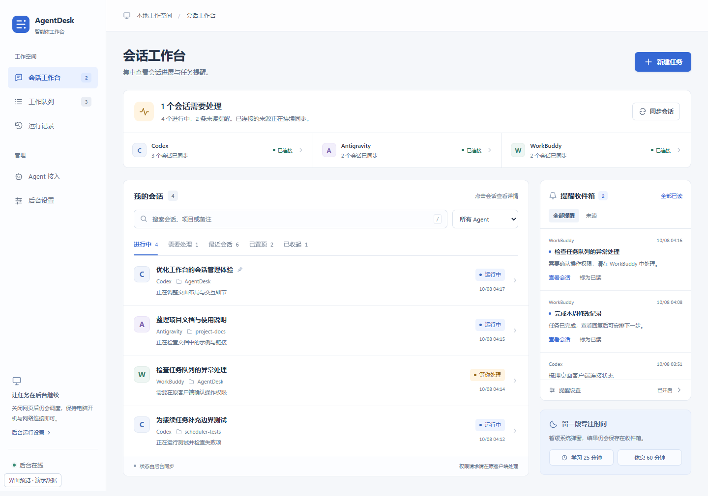

# AgentDesk · 智能体工作台

在本机统一安排 Codex、Antigravity 和 WorkBuddy 的任务：定时发送、队列执行、完成后接续，以及会话状态与结果提醒。

## 前言

在 AI 逐渐成为日常工作伙伴的今天，写好一条提示词只是开始。随着我们同时使用越来越多的 Agent，如何分配任务、安排执行顺序、跟进进度，也成为了工作中重要的一部分。

你可能也遇到过这样的时刻：一个长任务还在运行，下一步已经想好了，却只能等它结束后再发送；某个 Agent 的额度暂时用完，需要等到重置后才能继续；几个任务分散在不同客户端里，既要记住谁在做什么，又要反复切换窗口，确认结果、处理请求、安排后续。

这些等待本身未必能消除，但我们可以提前安排好接下来要做的事。把适合的任务交给合适的 Agent，把发送时间、执行顺序和前置条件写清楚，让任务在条件满足时有序接续，而不必每一步都守在屏幕前。

**AgentDesk** 就是为此而做的一个本地工具。它将跨 Agent 的定时任务、工作队列、会话观察和完成提醒放在同一个界面中，希望让我们少花一些精力盯进度、多花一些精力判断方向和检查结果。长任务运行时，可以安心去做别的事；知道额度何时恢复时，可以提前预约下一条消息；需要多个 Agent 配合时，可以先把任务与顺序安排好。

## 界面预览



截图使用演示数据。界面支持浅色导航、会话详情抽屉、搜索筛选与窄屏布局。

## 能做什么

| 功能 | 用途 |
| --- | --- |
| 定时发送 | 预先写好提示词，在指定的北京时间发送；支持多个一次性时间点 |
| 工作队列 | 就绪任务按顺序发送，每条消息可单独编辑、暂停和排序 |
| 任务接续 | 等前置任务成功后发送下一条消息，也可等待桌面客户端中正在运行的任务 |
| 跨 Agent 安排 | 在 Codex、Antigravity 和 WorkBuddy 之间分配后续任务 |
| 会话工作台 | 查看本机原生会话，按状态、Agent、项目或备注筛选，支持置顶与关注 |
| 完成提醒 | 收集完成、失败、停止与需要处理的结果，可使用 Windows 系统通知 |
| 专注与休息 | 暂缓系统弹窗，结果继续保存在提醒收件箱 |
| 执行记录 | 保留实际发送的提示词、回复、日志和处理请求，便于回溯 |

例如，可以先安排 Codex 完成一项修改，成功后让 WorkBuddy 按预设提示词检查结果，再安排 Antigravity 整理文档。跨 Agent 接续发送的是你事先写好的任务，不会自动搬运前一步的对话上下文。

## 快速开始

主要运行环境为 **Windows + Node.js 22.13 或更新版本**。项目没有需要安装的 npm 依赖。原生会话读取使用 Node.js 内置 SQLite，因此需要支持无启动标志加载该模块的版本；参见 [Node.js SQLite 文档](https://nodejs.org/download/release/v22.13.1/docs/api/sqlite.html)。

下载源码后，在项目目录执行 `npm start`；也可以克隆仓库后启动：

```bash
git clone https://github.com/NewbieonfireSpongeforknowledge/AgentDesk.git
cd AgentDesk
npm start
```

也可以双击 `start.cmd`。浏览器会打开 [本地工作台](http://127.0.0.1:43127)，关闭网页后后台继续运行。

1. 打开并登录要使用的 Agent 客户端，在“Agent 接入”中检测连接。
2. 点击“新建任务”，选择 Agent、项目文件夹与目标对话。
3. 设置发送时间或前置条件，填写提示词并保存。

“测试发送”会真实调用所选 Agent，并使用少量额度。WorkBuddy 的只读会话观察可以直接使用；发送接续消息需要启用桌面桥。具体接入步骤见 [使用指南](docs/usage.md#agent-接入)。

停止后台：

```bash
npm stop
```

也可以使用面板中的“停止后台”或双击 `stop.cmd`。

### 只体验界面

不连接 Agent 也可以运行演示：

```bash
npm run preview
```

打开 [演示工作台](http://127.0.0.1:43128)。演示使用内存数据，不读取真实任务、不发送消息；退出进程后改动清空。演示与正式后台使用不同端口。

## 运行方式与当前边界

- **任务分配由你决定。** 你选择每条任务使用的 Agent，系统按预设条件调度；当前不做自动模型选择或智能负载均衡。
- **队列全局串行。** 会话工作台可以同时观察多个客户端任务，本面板的任务发送一次只运行一个。
- **额度恢复时间需要手动安排。** 可以按已知的重置时间预约任务，当前不会自动检测账号额度或重置时间。
- **后台依赖本机运行。** 关闭网页不影响调度；后台停止、电脑睡眠、关机或断网会影响执行。可在设置中启用登录后启动和保持唤醒。
- **状态不明时保留记录并暂停。** 后台异常结束或发送结果无法确认时，不会自动重发；需要先在原客户端核实。
- **桌面适配器依赖客户端版本。** Antigravity 与 WorkBuddy 接入使用客户端本机接口，属于本项目的兼容实现；客户端升级后可能需要重新检测或适配。

完整的发送条件、编辑保护、原生会话观察范围、权限和失败处理见 [使用指南](docs/usage.md)。macOS 与 Linux 的桌面发现、系统通知和自启动等功能尚未完成全面适配与验证。

## 数据与配置

默认数据保存在 `data/`，包括任务、提示词、回复、备注、会话映射和提醒。该目录、临时工作目录、Agent 本地配置及常见凭据文件已被 `.gitignore` 排除。执行任务时，消息会通过所选 Agent 发送到其使用的服务。

| 环境变量 | 用途 |
| --- | --- |
| `CODEX_SCHEDULER_PORT` | 正式面板端口，默认 `43127` |
| `CODEX_SCHEDULER_DATA` | 自定义数据目录 |
| `CODEX_SCHEDULER_BINARY` | Codex 程序路径 |
| `ANTIGRAVITY_SCHEDULER_BINARY` | Antigravity CLI 程序路径 |
| `WORKBUDDY_SCHEDULER_BINARY` | WorkBuddy CLI 入口路径 |
| `WORKBUDDY_DESKTOP_BINARY` | WorkBuddy 桌面程序路径 |

客户端需要各自完成安装和登录。项目不会附带客户端安装包、账号或访问凭据。使用自定义数据目录时，请同时确认该目录不会进入版本控制；更多说明见 [SECURITY.md](SECURITY.md)。

项目已更名为 AgentDesk。为兼容已有安装，环境变量继续沿用原名称，数据目录和启动方式不变。

## 开发与贡献

```bash
npm test         # 自动化测试，使用模拟客户端与临时数据
npm run preview  # 使用演示数据调试界面
npm run serve    # 前台运行真实后台
```

| 目录或入口 | 内容 |
| --- | --- |
| `server.mjs`、`launch.mjs` | 本机 HTTP 服务、启动与停止 |
| `lib/` | 调度、原生会话观察、Agent 适配器与系统集成 |
| `web/` | 无构建步骤的前端页面与交互 |
| `test/` | 队列、依赖、编辑保护、恢复与适配器测试 |
| `examples/` | 不连接真实客户端的界面演示 |
| `docs/` | 详细使用指南与演示截图 |

欢迎提交问题、改进建议与适配器贡献。提交前请阅读 [CONTRIBUTING.md](CONTRIBUTING.md)。

## 许可

本项目采用 [MIT License](LICENSE)，标准许可文本可参见 [Open Source Initiative](https://opensource.org/license/mit)。

本项目为独立工具，与 OpenAI、Google、腾讯不存在官方隶属关系。Codex、Antigravity、WorkBuddy 及相关名称、商标和第三方客户端的权利归各自权利人所有。
